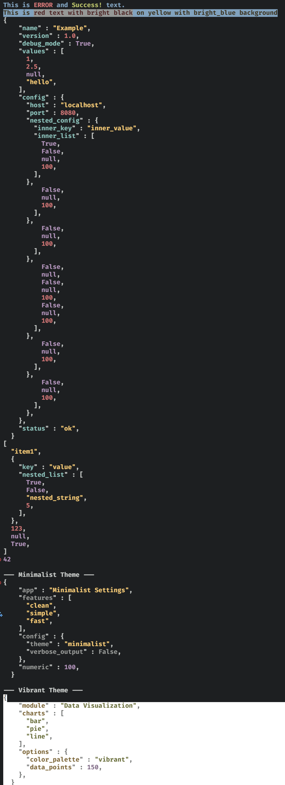

# ColorDoll: Nested ANSI Colorization for Python

[](https://badge.fury.io/py/colordoll)
[](https://github.com/kaigouthro/colordoll/actions/workflows/python-package.yml)

ColorDoll is a Python library that provides flexible and powerful ANSI colorization, including nested colorization, chainable fluent string APIs, and theming for complex data structures like dictionaries, lists, JSON, and YAML strings.

And, it's fairly Quick.

## 🚀 Performance Benchmarks ⏱️

`(amd 3800, 3200mhz ram, single XPG-8200 nvme, win11) - v0.1.12`

| Function             | Runs      | Min Time (sec) | Max Time (sec) | Avg Time (sec) | As milliseconds | Runs / second  |
|----------------------|-----------|----------------|----------------|----------------|-----------------|----------------|
| `colorize`           | 10,000    | 0.000006       | 0.000006       | 0.000006       |       0.006     | ~166000        |
| `theme_colorize`     | 10,000    | 0.000046       | 0.000047       | 0.000047       |       0.047     | ~21000         |
| Themed Decorator     | 10,000    | 0.000015       | 0.000015       | 0.000015       |       0.015     | ~66000         |

## Features

* **Intelligent Object Wrapping (New!):** Introduces `ColoredData`, making colored strings behave natively like their underlying objects (dicts/lists) for logical comparisons, iterations, and attribute access, while keeping their ANSI format.
* **Chainable String API (New!):** Use the `c()` helper for a fluent, object-oriented way to chain colors (e.g., `c("text").red.bg_white`).
* **Nested Colorization:** Handles nested ANSI color codes gracefully, ensuring correct color rendering even with complex formatting, intelligently detecting and avoiding double-quotes on pre-colored strings.
* **Theming:** Supports predefined and custom themes for consistent colorization across your output.
* **Data Structure Coloring:** Colorizes dictionaries, lists, JSON, and YAML strings recursively, highlighting keys, values, and different data types.
* **Decorator Support:** Provides decorators for easily colorizing function outputs and applying themes. Defaults to safely returning your unmutated data while handling the printing automatically.
* **Customizable Configurations:** Allows loading color configurations from JSON or YAML files/strings, or dictionaries.
* **YAML Output:** Provides a handler for colorized YAML output of structured data.
* **Color Removal:** Includes a utility handler to reliably strip ANSI color codes from output.
* **Extensible Output Formatting:** Supports custom output handlers for diverse formatting needs.

## Installation

```bash
pip install colordoll
```

For YAML-specific features (like `YamlHandler` or loading YAML configurations), you'll also need `PyYAML`:

```bash
pip install PyYAML
```

Alternatively, you might be able to install with an extra:

```bash
pip install colordoll[yaml]
```

*(Check the project's `setup.py` or `pyproject.toml` for available extras.)*

## Usage

### Basic Colorization

```python
from colordoll import default_colorizer, red, blue, bright_black, bg_blue

# Using color functions
print(red("This is red text."))
print(blue("This is blue text."))

# Using the colorize method with foreground and background colors
yellow_text = default_colorizer.colorize("This is yellow text on blue background\nSome terminals have trouble with both, but it is there on highlight", "yellow")
added_bg = bg_blue(yellow_text)
print(added_bg)

# Handling nested colors correctly
print(bright_black(f"This is {red('red text')} inside grey text."))
```

### Chainable String API

For a more fluent, object-oriented approach to coloring inline text, use the `c()` helper. This allows you to chain foreground and background colors directly as attributes.

```python
from colordoll import c

# Chain foreground and background colors fluently
fluent_text = c("Chainable text is awesome!").bright_white.bg_magenta
print(fluent_text)

# Great for quick f-string injection
print(f"Status: {c(' OK ').green.bg_black}")
```

### Themed Colorization (JSON/Dict)

The default output handler formats data structures like dictionaries and lists into a JSON-like string. **As of v0.1.12, decorated functions automatically print the colored structure to the console while returning the original dictionary/list.**

```python
from colordoll import default_colorizer, darktheme, vibranttheme, DataHandler

# Ensure default handler is DataHandler (usually is by default)
default_colorizer.set_output_handler(DataHandler())

@darktheme
def get_data():
    return {"key1": "value1", "key2":[1, 2, 3], "key3": True}

@vibranttheme
def get_other_data():
    return[{"name": "Item 1", "value": 10}, {"name": "Item 2", "value": 20}]


# Automatically prints to console, and stores the original raw dictionary in variables!
data = get_data()
other_data = get_other_data()

# If you prefer the decorator to return the colored string instead of printing, pass `False`:
@darktheme(False)
def get_silent_data():
    return {"silent": True}

colored_str = get_silent_data()
print(colored_str) # Prints manually
```

### Intelligent Data Wrapping & Mixed Coloring

You can safely embed manual ANSI colors into structured data. ColorDoll detects already-colored values so it doesn't double-escape them. Furthermore, because of the `ColoredData` wrapper, returned values look like strings in the terminal, but still act exactly like their native Python object under the hood!

```python
from colordoll import darktheme, yellow

@darktheme
def status_report():
    # 'ERROR' is manually colored yellow, the rest of the dict uses the Dark Theme automatically
    return {"status": yellow("ERROR"), "count": 5}

report = status_report()

# `report` prints with full ANSI colors, but acts exactly like the original dict!
if report["count"] > 0:
    print("Errors found!")
```

### Monotone Theming (Wrap Decorators)

Quickly theme an entire structured output with a single color using wrap decorators.

```python
from colordoll import wrapmono

@wrapmono("red")
def get_all_red_data():
    return {"alert": "System critical", "items":[1, 2, 3], "active": False}

@wrapmono("green")
def get_all_green_data():
    return {"info": "System nominal", "details": {"status": "OK", "code": 200}}

# Automatically prints colored text to the console
red_data = get_all_red_data()
green_data = get_all_green_data()
```

### Custom Themes and Configurations

```python
from colordoll import Colorizer, ColorConfig, DataHandler

custom_colorizer = Colorizer(output_handler=DataHandler())

# Create a custom theme
my_theme = {"key": "bright_magenta", "string": "cyan", "number": "yellow", "bool": "green", "null": "red", "other": "blue"}

# Colorize data using the custom theme
data_to_color = {"my_key": "my_value", "numbers":[1.00, 2.6, 3], "valid": None}

# Alternatively, instantly print it using wrap_block
custom_colorizer.set_theme(my_theme)
custom_colorizer.wrap_block("my_theme", data_to_color)
```

### YAML Output

ColorDoll can output data as colorized YAML. Requires `PyYAML`.

```python
from colordoll import default_colorizer, YamlHandler, light_theme_colors

# Set the output handler to YamlHandler
default_colorizer.set_output_handler(YamlHandler())

my_data = {"project": "ColorDoll", "version": "0.1.12", "features":["theming", "yaml_output", "nested_colors"], "config": {"active": True, "level": 5}}

colored_yaml_output = default_colorizer.theme_colorize(my_data, light_theme_colors)
print(colored_yaml_output)
```

### Removing ANSI Colors

You can strip ANSI color codes from the output.

```python
from colordoll import default_colorizer, ColorRemoverHandler, DataHandler, vibrant_theme_colors

# Sample data
data_to_process = {"message": "This is a colorful message!", "id": 12345}

# 1. Get a normally colored output (using DataHandler)
default_colorizer.set_output_handler(DataHandler())
normally_colored_output = default_colorizer.theme_colorize(data_to_process, vibrant_theme_colors)
print(f"Normally Colored:\n{normally_colored_output}")

# 2. Get output with colors stripped (using ColorRemoverHandler)
default_colorizer.set_output_handler(ColorRemoverHandler())
stripped_output = default_colorizer.theme_colorize(data_to_process, vibrant_theme_colors)
print(f"\nColors Stripped:\n{stripped_output}")
```

## Examples Above in terminal


## Contributing

Contributions are welcome! Please feel free to submit pull requests or open issues.

## License

This project is licensed under the MIT License.

## Change Log

### v0.1.12

* **Introduced `ColoredData` Wrapper:** A powerful "invisibility cloak" subclass that masquerades as your original data object. Colorized output behaves natively for dictionary/list access, logic, and iteration, while rendering as an ANSI colored string in the console.
* **Added `CStr` / `c()` Chainable String API:** Added a fluent interface for inline coloring, making it easy to chain colors (e.g., `c("text").red.bg_blue`).
* **Upgraded Decorator Defaults:** Themed decorators now default to printing the colored output (`do_print_setting=True`) while seamlessly returning your original unmutated data object. When configured to return a themed string, they return `ColoredData`.
* **Intelligent ANSI Detection:** `DataHandler` now utilizes a new `_is_colorized` helper to detect strings that already contain ANSI escape codes. This prevents re-colorizing or double-quoting strings, opening the door for safely nested custom color injections.
* **Added `Colorizer.wrap_block()`:** A convenience method for executing one-off themed printing without needing to define a decorated function.
* **Enhanced ANSI Stripping:** Improved the regex in `ColorRemoverHandler` for more robust and reliable color code removal.
* *(Internal)* Updated `Colorizer.colorize()` logic to correctly preserve ANSI codes in deeply nested string iterations.

### v0.1.11

* Internal refactors and documentation improvements (type hints, docstrings, formatting).
* Cleaned up decorator factory logic and improved code readability.

### v0.1.10

* Improved nested ANSI color handling in `Colorizer`.
* Made the decorator and theming system more consistent when returning original vs themed values.

### v0.1.9

* Minor improvements and stability fixes from internal refactors.

### v0.1.8

* Default theme in colorizer.
* `Colorizer.set_theme({})` to set theme to use with `Colorizer.theme_colorize(text)` making the theme input optional for temp over-riding.
* Wrapping themes can now take a bool to pass return value and print at the same time.

### v0.1.7

* Updated performance benchmarks.
* Improved internal logic for `colorize` for more robust nested color and background/foreground combination handling.

### v0.1.6

* Added "monotone wrap" decorators (e.g., `@wrapmono("red")`) for quick single-color theming of structured data output.
* Expanded the set of direct color applications to strings to have all bg coloring as well.

### v0.1.5

* Implemented `ColorRemoverHandler` to strip ANSI escape codes from formatted output, allowing for easy generation of plain text versions.

### v0.1.4

* Added `YamlHandler` for colorized YAML output of dictionaries and lists. Requires `PyYAML`.
* Enhanced `ConfigLoader` to support loading color configurations from YAML files and strings.

### v0.1.3

* Introduced a pluggable `OutputHandler` system (`OutputHandler`, `DataHandler`) allowing for more flexible and extensible output formatting.
* Refactored `Colorizer` to utilize the new `OutputHandler` system for `theme_colorize` operations.

### v0.1.2

* Added performance benchmarks (`bench.py`) to the repository.
* Minor refactorings and code improvements.

### v0.1 (Initial Release)

* Implemented core colorization functionality for basic string coloring.
* Created robust nested colorization and background colorization abilities.
* Introduced theming for structured data (dictionaries, lists) and decorator support (`@darktheme`, etc.).
* Enabled custom color configurations via dictionaries (and implicitly JSON files).
* Included various pre-defined themes (dark, light, vibrant, minimalist).


